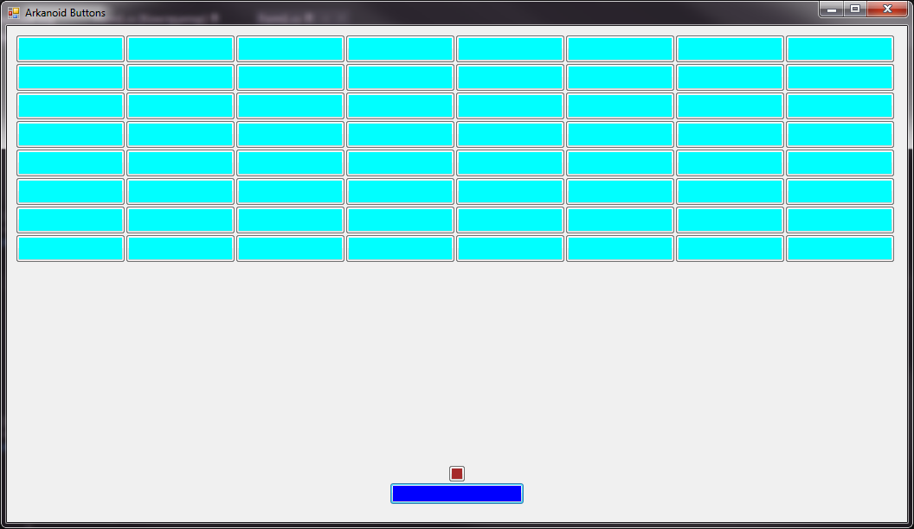

# ArkanoidBtns

This is simple arkanoid game implementation using standard Windows GUI and OOP methodology in C#.

## Features:

1. All elements in game are buttons.
2. Support resize the main window.

# AUTHOR
   An0ther0ne
